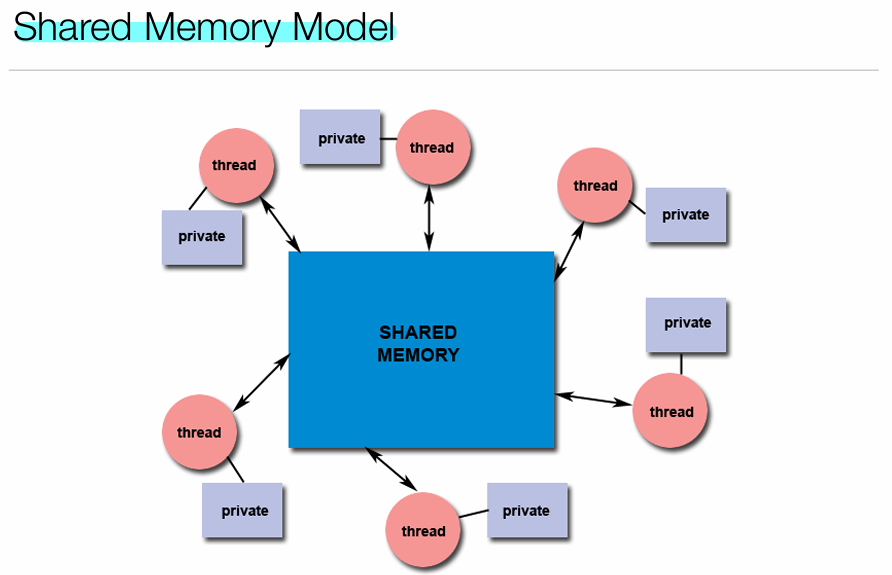
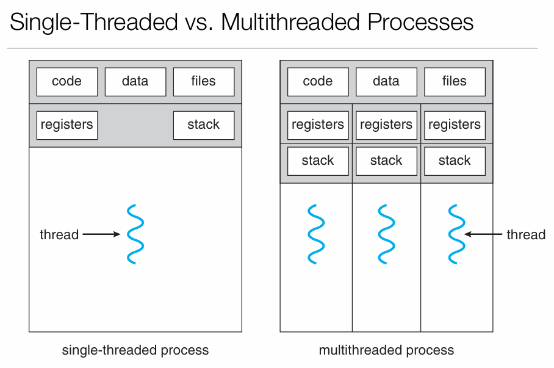
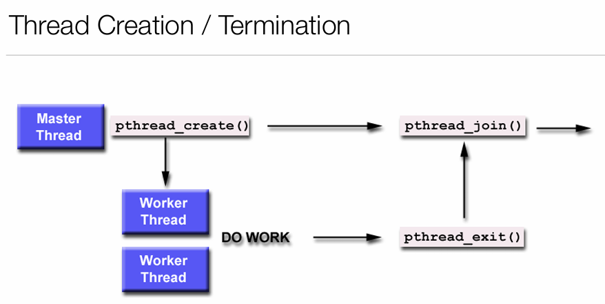
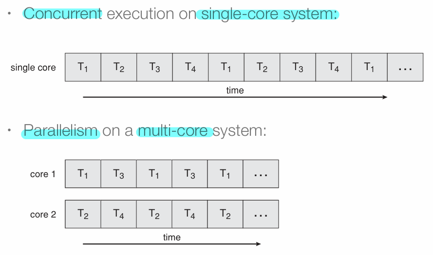
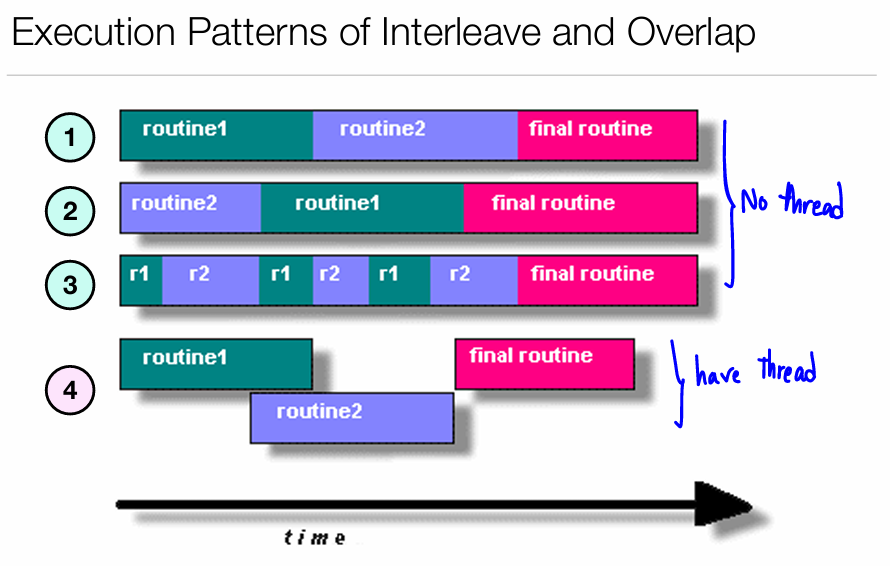

# Multithreaded Programming

## Introduction to Threads
- **Thread**: A light-weight process running within an application.
- **Multithreading**: Allows multiple tasks to execute concurrently within an application.
- Threads share **code, data, and heap** but have their own **program counter and stack**.
- Benefits:
  - Simplifies code.
  - Increases efficiency.
  - Reduces process creation overhead 
    - process creation = heavy-weight, while thread creation = light-weight.

## Single-threaded vs. Multithreaded Processes
- **Single-threaded process**: Only one thread of execution.
- **Multithreaded process**: Multiple threads executing simultaneously within the same process.

## Thread Creation & Termination
- Threads can be created dynamically and execute independently (may create other threads).
- No strict hierarchy among threads; all are equal.
  

## Thread Scheduling
- CPU schedules threads similarly to processes.
- Scheduling is arbitrary, so programs should not rely on thread execution order.
- Thread execution order may vary between runs , execute order $\neq$ create order (reason above).
## Multicore Programming
### Concurrency vs. Parallelism
- **Concurrency**: Supports multiple tasks making progress, even on a single-core system with scheduler.
- **Parallelism**: True simultaneous execution on a multicore system.
- **Data Parallelism**: The same operation on distributes subset of data sets (GPU).
- **Task Parallelism**: Different operations performed in parallel.

## Threading Issues
### User Threads vs. Kernel Threads
- **User Threads**: Managed at the user level threads library (e.g., Pthreads, Java threads).
- **Kernel Threads**: Managed by the OS (kernel) (e.g., Windows, Linux, macOS).
- **Thread Models**:
  - **Many-to-One**: Multiple user threads mapped to a single kernel thread.
    - One thread blocking cause all threads to block.
    - Multiple threads may not run in parallel on multicore system because only one in kernel.
  - **One-to-One**: Each user thread maps to a kernel thread (e.g., Windows, Linux).
    - Creating user thread -> creating kernel thread.
    - More concurrency than many-to-one.
  - **Many-to-Many**: Multiple user threads mapped to multiple kernel threads.
    - OS creates a sufficient number of kernel threads (similar to thread pool).
  - **Thread Pools**:Pre-creates a number of threads to handle incoming tasks.
    - Reduces thread creation overhead -> slightly faster.
    - Allows the number of threads in the application to be bound to size of pool.

### fork() with thread
- **fork()**: child not clone thread (only main thread).

## Benefits of Multithreading
- **Lightweight process execution**
  - Lesser creation overhead compared to process.
  - More efficient inter communication between threads.
  - Lesser context-switching overhead because don't need to deal with memory.
- **Efficient CPU utilization**
- **Simplifies complex applications**: Tasks can be divided among threads.

