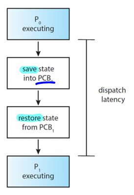
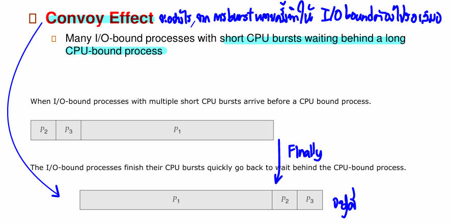
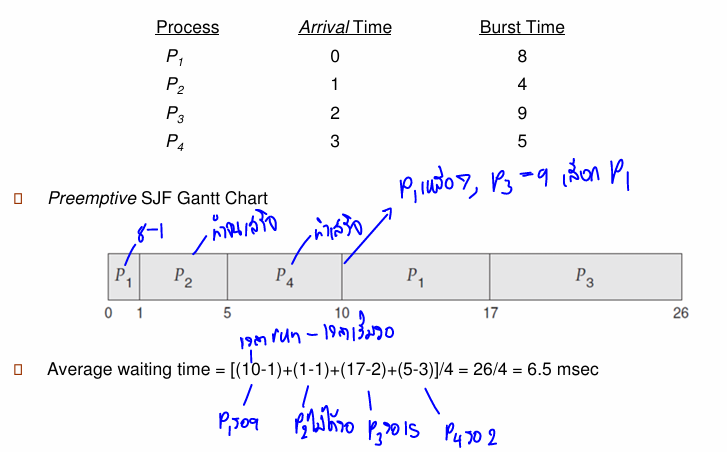

# Process Scheduling

## Objectives
- Introduce **CPU scheduling** as a fundamental aspect of multiprogramming.
- Describe various **CPU scheduling algorithms**.
- Explain **evaluation criteria** for choosing a scheduling algorithm.
- Discuss **real-world implementations** in operating systems.

## CPU Scheduling Basics
- In a single processor,  normally only one process can execute at a time, but might have virtual core.
- **CPU-I/O Burst Cycle**: A process alternates between CPU execution and I/O wait.
   - CPU burst followed by I/O burst.
- **Multiprogramming**: Allows CPU to switch processes to maximize utilization.
   - while wait for I/O, CPU can be rescheduled to run another process.
- **Scheduler**: fundamental OS function.
   - Determines process execution order.
   - Resource allocation
   - Maximize CPU utilization.

## Type of process
- **CPU-bound process**: lot of long CPU bursts
- **I/O-bound process**: lot of short CPU bursts

## Scheduling Thing
- **Processor affinity**: Processes are assigned to specific CPUs.
- **PRI**: Processes are assigned a priority, lower PRI->higher priority.
- **Niceness**: `PRI = 20 + niceness`

## CPU Scheduler / Short-term scheduler
- Selects process from `ready queue (may be ordered in various way)` to execute.
CPU scheduling take place when process changing their state.
   - Switches from running to waiting (non-preemptive)
   - Switches from running to ready (preemptive)
   - Switches from waiting to ready (preemptive)
   - Terminates (non-preemptive)

**preemptive**: OS forces running process leave the CPU.
   - most OS support, and they must consider
      - Access shared data -> race condition
      - Preemption during crucial OS activity -> kernel data structure must be managed carefully

**non-preemptive**: process leave the CPU by itself.

## Dispatcher : Save state
- Dispatcher module gives control of the CPU to the process selected by CPU scheduler, which involves:
   - switching context
   - swiching to user mode
   - jumping to the proper location in the user program to restart that program.
- **Dispatch latency**: time take for dispatcher to stop one process and start anothers process.

## Scheduling Criteria
- **CPU Utilization**: **% of time** the CPU is executing. (Maximize)
- **Throughput**: Number of completed processes **per time unit**. (Maximize)
- **Burst time**: Total amount of time a process use the CPU.
- **Waiting Time**: Time spent **in the ready queue**. (Minimize)
- **Turnaround Time**: **Amount of time** to execute a particular process. (Minimize)
   - Turnaround time =  burst time + waiting time
- **Response Time**: **Time between** request submission and first response. (Minimize) 
   - For interactive program

## Scheduling Algorithms
### **1. First-Come, First-Served (FCFS)**
- Non-preemptive.
- Order effect -> average waiting time (Convoy effect)
- Simple but lead to **convoy effect** (long processes delay short ones).

### **2. Shortest Job First (SJF)**
- Selects the process with the shortest CPU burst.
- Optimal in **minimizing waiting time** but may lead to **starvation** (long burst waits for short ones).
- **Preemptive SJF** (Shortest Remaining Time First) allows interruption for a shorter job.
- Hard to implement -> how to predict burst time? -> based on previous ones

### **3. Priority Scheduling**
- SJF is priority where priority is inverse of predicted next CPU burst time.
- SJF not general enough + hard to implement + overhead to predict -> priority based scheduling.
- Process with the highest priority (smallest integer) executes first.
- Can be **preemptive or non-preemptive**.
- **Issue**: Starvation of low-priority processes  (may never execute) (solved by **aging**).
- **Aging**: Priority increase over time.

### **4. Round Robin (RR)**
- Each process gets a small **time quantum (q)** after time is elapsed, process is preempted.
- No process waits more than q time units, **prevent starvation**.
- Designed for **time-sharing systems**.
- **How to select length of time quantum**
   - If q is extremely large RR become FIFO.
   - If q is small lead to frequent **context switches**  lead to performance overhead.
   - q should be larger than 80 % of CPU bursts.

### **5. Multilevel Queue Scheduling**
- Ready queue partitioned into separated queues **each queue has its own scheduling algorithm**.
   - **Foreground**: Interactive processes (RR)
   - **Background**: Batch (FCFS)
- Processes are permanently assigned to one queue, base on some properties (e.g.priority, process type, memory size).
- Scheduling is done between queues
   - **Fixed priority scheduling**: Serve all from Foreground then Background.
   - **Time slice**: Each queue gets certain amount of CPU time to schedule among its processes.

## Thread scheduling
   - **Process-contention scope (PCS)**: user thread -> kernel thread
   - **System-contention scope (SCS)**: kernel thread -> CPU

## Multiple-Processor Scheduling
- **Load Balancing**: Distribute workload evenly across CPUs, often counteract with process affinity.
- **Processor Affinity**: Keep processes on the same CPU to improve cache performance.

